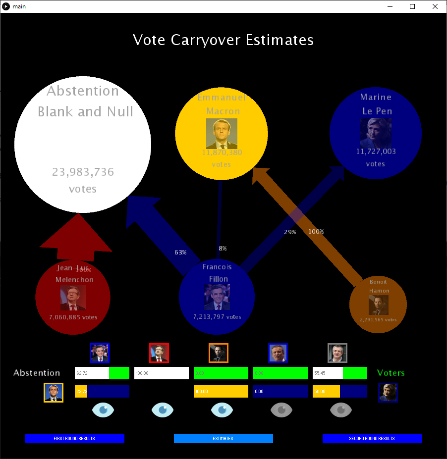

# Vote Carryover Meter

- Programming language: **Processing**
- Integrated development environment (IDE): **Processing**
- Intended platforms: **Processing**

## 1. User Guide

This user guide describes the application, its main functionalities and use case.

### 1.1 Description of the Application

The application models the phenomenon of vote carryover in French presidential elections between the
first round and second round. The user can dynamically simulate the result of carryover votes on the two candidates in the second round and abstention.

### 1.2 Main Functionalities

#### 1.2.1 Network of Candidates

The candidates are displayed in the form of a network, linked together with arrows which represent votes carryover.
The candidates are materialized by colored circles of size proportional to the number of votes they got. 
It is possible to move the circles of the network to improve readability.
The carryover votes are materialized by arrows of proportional width and transparency to the number of votes carried over. 
The arrows also indicate the percentage distribution between the two candidates of the second round and abstention.

#### 1.2.2 Control Panel

Under the candidate network, a control panel is displayed. It allows the user to change the vote carryover by the means of only two sliders :
- Between abstention and voters: white represent the percentage of abstention and by difference, green represents the percentage of voters.
- Between the two candidates who passed the first round: the colors used correspond to the color of the candidates in the network. 
By varying the sliders, the user can dynamically visualize the effect of the vote carryover on the candidate network. 
If the user sets an abstention at 100%, the slider disappears. 
To improve the readability of the simulation, it is possible to filter the candidates so as to display only vote carryover of a particular candidate. To do this, you must click on the icon representing an eye under each candidate who didn't pass the first round.

#### 1.2.3 Actual Results
The user has the possibility to compare his simulation with the real election results of the French elections in the first and second round of April and May 2017. For this, two buttons are available "First Round Results" and "Second Round Results". By clicking on the buttons, the users can dynamically visualize the differences between their simulation and the actual results.

## 2. Developer Guide

This guide for the developer in charge of maintaining the application presents the software architecture, the classes used and the data model handled by the application.

### 2.1 Controller Main

As per Processing requirements, the application is launched via the Main containing the required methods setup() and draw() and the event listeners.

### 2.2 Data Model

#### 2.2.1 Class Candidate

This class defines the attributes for a Candidate.

#### 2.2.2 Class VoteCarryover

This class defines the attributes for a VoteCarryover

### 2.3 Views

#### 2.3.1 View Meter

This class contains the methods to display the Meter.

#### 2.3.2 View Candidate

This class contains the methods to display a Candidate.

#### 2.3.3 View VoteCarryover

This class contains the methods to display a VoteCarryover

### 2.4 Libraries

The ControlP5 library, by Sojamo, was used to manage the display of buttons, sliders and control panel checkboxes and their related events.
